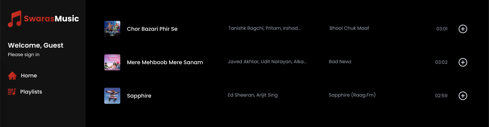
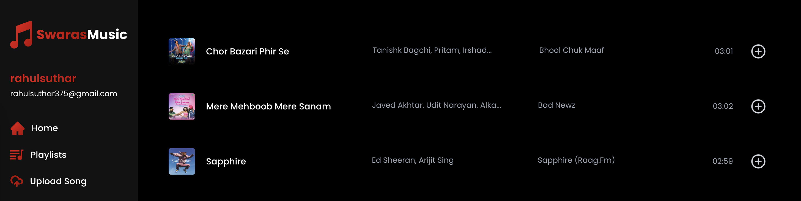

## swaras-music-app

A modern full-stack music streaming web application where users play their favorite tracks. Built with **Next.js 14 (App Router), NextAuth.js** for authentication, **MongoDB** for storage, and **Cloudinary** for file hosting. The app includes a special admin-only route where only the admin user can upload new songs, ensuring content control and moderation.
 

***Landing Page***



---

***Admin Page***




---
### 🚀 Features

* 🎧 **Music Playback** – Custom audio player with volume, progress, and seek controls
* 🔐 **Authentication** – Secure login and logout with **NextAuth.js (email + password)**
* ☁️ **Cloudinary Integration** – Upload songs and cover art with seamless storage
* 🧠 **Metadata Extraction** – Automatically extract and store song title, artist, album, and artwork
* 📂 **Playlist Management** – Create, manage, and add songs to personal playlists
* 🖼️ **Cover Image Display** – Show album artwork on player
* ⚙️ **Responsive UI** – TailwindCSS-based design with mobile-first responsiveness
* 💾 **MongoDB Database** – Store user data, songs, and metadata
* 🔄 **Context API** – Global audio state management using React Context
* 📧 **Email Verification via Resend + Axios**

---

### 🛠️ Tech Stack

* **Next.js (App Router)**
* **NextAuth.js** (Credentials-based login)
* **Cloudinary** (Song & image uploads)
* **Resend** (Email sending API)
* **Axios** (HTTP requests)
* **Tailwind CSS** (Styling)
* **MongoDB + Mongoose** (Database)
* **bcryptjs** (Password hashing)
* **react-hot-toast** (User notifications)
* **react-email** (Email templating)

---

### ⚙️ Setup Instructions

#### 1. **Clone the Repo**

```bash
git clone https://github.com/sutharrahul/swaras-music-app.git
cd music-app
```

#### 2. **Install Dependencies**

```bash
npm install
```

#### 3. **Setup Environment Variables**

Create a `.env.local` file in the root directory:

```env
# MongoDB
MONGODB_URI=""

# Resend Email
RESEND_API_KEY=""

# Next Auth
NEXTAUTH_SECRET=""

# Cloudinary
CLOUDINARY_CLOUD_NAME=""
CLOUDINARY_API_KEY=""
CLOUDINARY_API_SECRET=""
CLOUDINARY_URL=""
```

#### 4. **Run the App**

```bash
npm run dev
```

---

### 🔍 How It Works

#### 🔐 Authentication (NextAuth.js)

* Credentials provider with email + password
* Email verification handled via Resend API
* Only developer can login since domain isn’t verified


#### 🎼 Music Upload & Playback

* Uploads to Cloudinary
* Metadata extracted and stored in MongoDB
* Player uses `useRef`, `useEffect`, and global context

#### 📂 Playlist Management

* Songs can be added to or removed from playlists
* Each playlist is associated with a user and stored in MongoDB

---


### ✅ TODO / Future Features

* ❤️ Liked songs
* 🔍 Search functionality
---

### 👤 Author

* **Your Name** – [GitHub](https://github.com/yourusername) • [LinkedIn](https://linkedin.com/in/yourusername)

---

