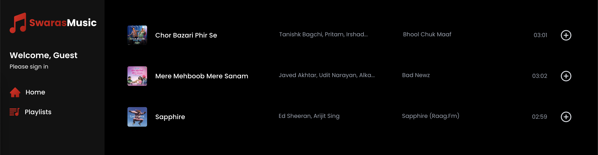
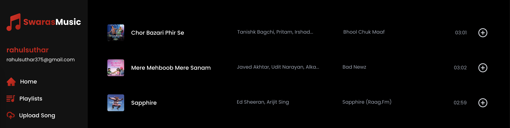

## swaras-music-app

A full-stack music streaming application that enables users to discover, upload, and manage their favorite tracks. Built on Next.js 15 (App Router) with Supabase for the database, authentication and media storage.

**_Landing Page_**



---

**_Admin Page_**



---

## Overview

Swaras is a music streaming platform with role-based access control. Admin users upload songs with automatic metadata extraction; anyone — signed in or not — can browse and listen; signed-in users create playlists and like tracks. Authorization is enforced three times over: middleware, a server-side session check in every route handler, and Postgres Row Level Security underneath both.

---

## 🎯 Core Features

### User Features

- 🎧 **Advanced Music Playback** – Custom audio player with intuitive controls (volume, progress tracking, seek functionality), open to signed-out visitors too
- 🔐 **Secure Authentication** – Supabase Auth (email/password, with email confirmation)
- ❤️ **Liked Songs** – Save favorite tracks for quick access
- 📋 **Playlist Management** – Create, edit, and organize playlists
- 🎼 **Song Discovery** – Browse and search through available music
- 📱 **Responsive Design** – Optimized for desktop, tablet, and mobile devices

### Admin Features

- ⬆️ **Song Upload** – Upload music files with automatic metadata extraction
- 🏷️ **Metadata Management** – Define song title, artist, album, and cover art
- ☁️ **Cloud Storage** – Supabase Storage, uploaded resumably straight from the browser
- 🔒 **Role-Based Access Control** – Secure admin-only routes and operations

---

## 🛠️ Tech Stack

### Frontend

- **Next.js 15** (App Router) – React framework with server-side rendering
- **TypeScript** – Type-safe development
- **Tailwind CSS v4** + **shadcn/ui** (Radix primitives)
- **TanStack Query** – Server-state caching
- **React Context API** – Global state management for audio
- **Axios** – HTTP client for API requests

### Backend & Database

- **Next.js Route Handlers** – Serverless backend functions; there is no separate API service
- **Supabase Postgres** via **supabase-js / PostgREST** – no ORM and no database connections from the running app, so there is no serverless connection pool to exhaust
- **Row Level Security** – every table, enforced in the database
- **Supabase CLI migrations** – plain SQL in `supabase/migrations/`

### Authentication & Security

- **Supabase Auth** – email/password sign-in, email confirmation, `@supabase/ssr` cookie sessions
- **Role-based access control** – `public.users.role`, read live from the database on every request (never from a JWT claim)

### Storage

- **Supabase Storage** – `song-audio` (private, playback URLs signed server-side) and `song-covers` (public, so `next/image` can cache them)
- **tus-js-client** – resumable browser-to-Storage uploads
- **music-metadata** – ID3 tag extraction, in the browser

### Notifications & UX

- **react-hot-toast** – Toast notifications
- **lucide-react** – Icons

---

## 📋 Getting Started

### Prerequisites

- Node.js 20+ and npm
- A Supabase project (database, auth and storage all come from it)
- The Supabase CLI, used via `npx supabase` — no global install needed

### Installation

#### 1. Clone the Repository

```bash
git clone https://github.com/sutharrahul/swaras-music-app.git
cd swaras-music-app
```

#### 2. Install Dependencies

```bash
npm install
```

#### 3. Configure Environment Variables

`cp .env.example .env.local` and fill it in. The full annotated list is in `.env.example`; the short version:

```env
# Supabase. There is deliberately no DATABASE_URL — the app speaks HTTP to
# PostgREST and opens no database connections.
NEXT_PUBLIC_SUPABASE_URL="https://<project-ref>.supabase.co"
# Publishable key: safe in the browser, constrained by Row Level Security.
NEXT_PUBLIC_SUPABASE_PUBLISHABLE_KEY="sb_publishable_..."
# Secret key: BYPASSES RLS. Server-side only, never NEXT_PUBLIC_. Required —
# playback URLs are signed with it, so without it nothing plays.
SUPABASE_SECRET_KEY="sb_secret_..."

# Public origin, used as metadataBase and for auth redirects.
NEXT_PUBLIC_SITE_URL="http://localhost:3000"
```

In the Supabase dashboard, set Authentication → URL Configuration → Site URL to the same origin and add `<site>/auth/callback` to the redirect allow-list, or confirmation links will bounce.

#### 4. Apply the database schema

```bash
npx supabase link --project-ref <project-ref>
npm run db:push        # applies supabase/migrations/** in filename order
npm run db:types       # regenerates src/lib/database.types.ts
```

There is no seed script. The first ADMIN has to be promoted in SQL — see `docs/DEPLOYMENT.md`.

#### 5. Start Development Server

```bash
npm run dev
```

Open [http://localhost:3000](http://localhost:3000) in your browser.

---

## 🏗️ Project Structure

```
src/
├── app/                    # Next.js App Router
│   ├── api/               # Route handlers (the backend)
│   ├── auth/callback/     # Supabase code exchange
│   ├── sign-in/, sign-up/ # Auth pages
│   ├── admin/             # Admin dashboard
│   ├── playlist/          # Playlist pages
│   └── layout.tsx         # Root layout
├── components/            # React components
│   ├── MusicPlayer.tsx    # Audio player component
│   ├── auth/              # Sign-in / sign-up forms, user menu
│   └── ui/                # shadcn primitives
├── context/               # React Context
│   └── SongContextProvider.tsx
├── hook/                  # TanStack Query hooks + axios wrappers
├── hooks/                 # useSupabaseUser, useMediaSession
├── lib/
│   ├── auth.ts           # requireUser / requireAdmin / optionalUser
│   ├── dto.ts            # row → wire shape mapping
│   ├── storage.ts        # buckets, object paths, cover URLs (isomorphic)
│   ├── storage.server.ts # signs playback URLs — server-only, secret key
│   ├── tusUpload.ts      # Browser-side resumable upload
│   └── database.types.ts # generated from the live schema
├── utils/supabase/        # browser / server / middleware clients
└── types/                 # TypeScript types

supabase/
└── migrations/            # plain SQL, applied with the Supabase CLI
```

---

## 🔍 Key Features Explained

### Authentication Flow

1. Users sign up at `/sign-up`, which calls Supabase Auth from the browser
2. Supabase sends the confirmation email; the link lands on `/auth/callback`, which exchanges the code for a session
3. A trigger on `auth.users` provisions the matching `public.users` profile row. It never links an identity by email — attaching an auth identity to a pre-existing row that merely shares an address would be account takeover
4. Sessions are cookies managed by `@supabase/ssr`; the middleware refreshes them on every request and denies unauthenticated access to protected routes
5. `requireUser()` / `requireAdmin()` re-verify the session in every route handler with `getUser()` (which revalidates the token) and read the role live from `public.users`
6. Row Level Security enforces the same rules again in the database

### Music Upload Pipeline

1. The browser reads ID3 tags from the file with `music-metadata`'s `parseBlob`
2. `POST /api/upload-song` mints the job and the Storage object paths (the server derives every path; the client never supplies one)
3. The file uploads **from the browser straight to Supabase Storage** over TUS in 6MB chunks — the bytes never pass through a serverless function, which caps request bodies at ~4.5MB
4. Embedded cover art is uploaded to the public `song-covers` bucket
5. `POST /api/upload-song/complete` verifies the object landed at the expected size, re-validates the (untrusted) tag metadata with zod, and writes the `songs` row
6. Playback URLs are signed once per listing by `src/lib/storage.server.ts` (server-only, secret key) from the private `song-audio` bucket; covers are public. Signing is server-side precisely so no client can mint its own URL at its own TTL

### Playlist Management

- Users create and name playlists
- Add/remove songs from playlists
- Playlists associated with user accounts
- All changes persisted to database

### Audio State Management

- Global state using React Context
- Current song, playback status, queue
- Controls: play, pause, skip, volume
- Persistent player across navigation

---

## 📡 API Endpoints

Every handler takes the caller's identity from the verified session. None of them accepts a user id in a body, query param or header.

### Authentication

- Handled by Supabase Auth directly from the browser; `GET /auth/callback` exchanges the confirmation code for a session
- `GET /api/check-admin` – Whether the caller is an admin (for rendering only)

### Songs

- `GET /api/get-songs` – Paginated catalogue (public; `page`, `limit` clamped server-side)
- `GET /api/search` – Search songs and playlists
- `POST /api/upload-song` – Start an upload job, returns server-derived object paths (admin only)
- `POST /api/upload-song/complete` – Verify the object and register the song (admin only)
- `DELETE /api/admin/delete-song` – Delete a song and its Storage objects (admin only)

### Playlists

- `GET /api/playlists` – The caller's playlists
- `POST /api/playlists` – Create a playlist
- `GET /api/playlists/[playlistId]` – One playlist and its songs
- `DELETE /api/playlists/[playlistId]` – Delete a playlist
- `POST /api/post-playlist` – Add a song to a playlist
- `DELETE /api/remove-playlist-song` – Remove a song from a playlist

### Likes

- `POST` / `DELETE /api/like-song` – Like / unlike a song
- `GET /api/get-liked-songs` – The caller's liked songs

---

## 🚀 Deployment

`docs/DEPLOYMENT.md` is the real, step-by-step guide, including the Vercel and Supabase dashboard settings. The summary:

### Vercel (Recommended)

```bash
npm run build
vercel deploy
```

### Environment Setup for Production

- Set `NEXT_PUBLIC_SUPABASE_URL`, `NEXT_PUBLIC_SUPABASE_PUBLISHABLE_KEY`, `SUPABASE_SECRET_KEY` (mark it Sensitive) and `NEXT_PUBLIC_SITE_URL` (Production scope only)
- Apply migrations with `npm run db:push` **before** the deploy that needs them — nothing in the build applies them
- Set the Supabase Site URL and the `/auth/callback` redirect allow-list to the production domain
- Promote the first ADMIN in SQL; there is no API path for it
- Do **not** put a `DATABASE_URL` on Vercel — the app never opens a database connection

---

## 🧪 Testing

```bash
# Run linting
npm run lint

# Type checking
npm run type-check

# Build verification
npm run build
```

---

---

## 🛣️ Roadmap

### Completed

✅ Core music playback functionality
✅ User authentication and authorization
✅ Admin upload system
✅ Playlist management
✅ Like/favorite songs
✅ Responsive UI design

### In Progress

🔄 Advanced search and filtering
🔄 User profiles and settings

### Planned

📋 Social features (share playlists, recommendations)
📋 Offline playback support
📋 Equalizer and audio effects
📋 Podcast support
📋 Multi-language support

---

## 🤝 Contributing

Contributions are welcome! Please follow these steps:

1. Fork the repository
2. Create a feature branch (`git checkout -b feature/amazing-feature`)
3. Commit changes (`git commit -m 'Add amazing feature'`)
4. Push to branch (`git push origin feature/amazing-feature`)
5. Open a Pull Request

---

## 📝 License

This project is licensed under the MIT License – see the LICENSE file for details.

---

## 👨‍💻 Author

**Rahul Suthar**

- GitHub: [@sutharrahul](https://github.com/sutharrahul)
- LinkedIn: [suthar-rahul](https://www.linkedin.com/in/suthar-rahul/)
- Email: [Contact](mailto:your-email@example.com)

---

## 🆘 Support & Issues

Found a bug or have a feature request? Please open an issue on [GitHub Issues](https://github.com/sutharrahul/swaras-music-app/issues).

---

**Last Updated:** August 2026

---
