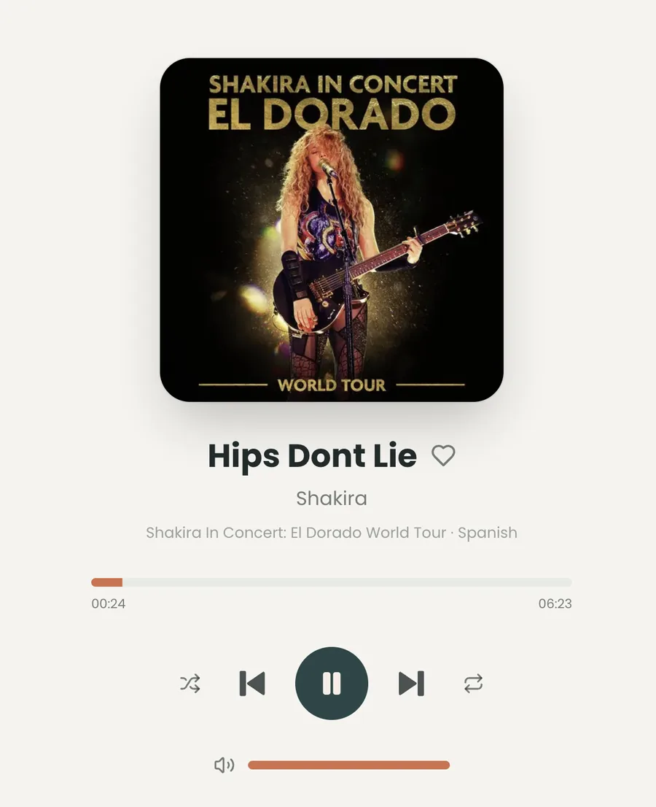

# Swaras

A music streaming app: admins upload tracks, anyone can browse and listen without an account, and signed-in users like songs and build playlists. It is a single Next.js 15 App Router application that is also its own backend — 20 Route Handlers, no separate API service — with Supabase supplying Postgres (through PostgREST, no ORM and no runtime `DATABASE_URL`), Auth and Storage. The parts worth reading are where that arrangement gets sharp: playback URLs are signed by exactly one `server-only` module, 100MB uploads bypass the serverless function entirely and go browser-to-Storage over TUS, and Row Level Security is real authorization rather than a checkbox.


**Live:** [music.rahuls.dev](https://music.rahuls.dev) · **Source:** [github.com/sutharrahul/swaras-music-app](https://github.com/sutharrahul/swaras-music-app)


_Home: the "Recently added" shelf and the Artists rail, both derived from song metadata._



_Now playing: the expanded view runs on the same audio element as the bottom bar._

## At a glance

|                  |                                                                                                            |
| ---------------- | ---------------------------------------------------------------------------------------------------------- |
| **What it is**   | Self-hosted music streaming — admin upload, public listening, per-user likes and playlists                 |
| **Stack**        | Next.js 15 (App Router) · React 19 · TypeScript · Tailwind v4 · TanStack Query · Supabase · Vercel         |
| **Architecture** | One Next.js app is the whole backend; Supabase is the database, auth and object store; RLS enforces access |
| **Scale**        | 18 pages · 20 API route handlers · 12 migrations · 13 tables · 31 RLS policies · ~132 files, ~13,400 lines |
| **Hosting**      | Vercel `bom1`, colocated with an `ap-south-1` Supabase project. Light theme only                           |

## Features

**For listeners**

- Home, `/songs`, artists, albums, movies and search are public and playable with no account.
- A persistent bottom bar handles seek, remembered volume, shuffle and repeat off/all/one; the artwork opens a full-screen now-playing view over the same audio element.
- The queue is whatever list you started from, so "play all" on an artist queues that artist, not the catalogue.
- Keyboard shortcuts cover the app, and the Media Session API mirrors the track to OS lock screens and hardware media keys.
- Likes and playlists need an account; the heart is server state, so it survives a reload and a second device.
- Sign-in, sign-up and forgot-password open as modals over the current page and still render as full pages on a direct hit.

**For admins**

- Upload up to 10 tracks at once, each up to 100MB, straight from the browser to Storage with per-file progress.
- ID3 tags and embedded cover art are read client-side; unreadable tags fall back to the filename rather than failing the file.
- Song metadata is editable from Manage Songs, rows can be bulk-selected and deleted, and artist photos and bios live in the Artists tab.
- The admin UI is gated on a live role check for rendering only — every endpoint re-checks with `requireAdmin()`, and RLS checks again in the database.

## How it works

The 18 pages and the 20 Route Handlers under `src/app/api/**` ship as one Vercel project in region `bom1`, next to an `ap-south-1` Supabase project so the many small PostgREST round-trips stay cheap. The data layer is `supabase-js` over HTTP to PostgREST: no ORM, no `DATABASE_URL` at runtime, no connection pool to size or exhaust — which is what makes serverless functions a reasonable place to put a backend at all. Types in `src/lib/database.types.ts` are generated from the live database, so a migration that breaks a query breaks `npm run type-check`.

Authorization is three layers, each assuming the others can fail. **Middleware** refreshes the auth cookies and matches the path against an explicit public list; anything unlisted gets a 401 or a redirect to `/sign-in`. **Handlers** learn the caller only through `requireUser()` / `requireAdmin()` / `optionalUser()`, never from a body, query param or header. **RLS** sits under both, so a handler that forgets a filter still cannot read another user's playlists.

Four decisions worth knowing:

- `src/lib/storage.server.ts` is the only module that may sign a playback URL, because any SELECT policy on the private `song-audio` bucket would let that role mint its own.
- Uploads never pass through a function: a Vercel body caps near 4.5MB and a track can be 100MB, so the browser goes straight to Storage over TUS.
- Roles are read live from `public.users.role`, never from a JWT claim, which would freeze at signup and survive a demotion.
- Artists and albums are derived from `songs` at query time, not modelled as tables — cheap to curate from ID3 tags, and it forks an artist on a typo.

Full detail in [docs/ARCHITECTURE.md](./docs/ARCHITECTURE.md).

## Quickstart

Node 20+, npm, and a Supabase project. The Supabase CLI runs through `npx`.

```bash
git clone https://github.com/sutharrahul/swaras-music-app.git
cd swaras-music-app
npm install
cp .env.example .env.local     # fill in the four variables below

npx supabase login
npx supabase link --project-ref <your-project-ref>
npm run db:push                # applies supabase/migrations/** (12 files)
npm run db:types               # regenerates src/lib/database.types.ts
npm run dev                    # http://localhost:3000
```

| Variable                               | What it is                                                                                      |
| -------------------------------------- | ----------------------------------------------------------------------------------------------- |
| `NEXT_PUBLIC_SUPABASE_URL`             | Project API URL. Also read at build time to derive the allowed `next/image` host.               |
| `NEXT_PUBLIC_SUPABASE_PUBLISHABLE_KEY` | Publishable (anon) key. Safe in the browser — it maps to `anon` and cannot bypass RLS.          |
| `SUPABASE_SECRET_KEY`                  | Server-only; bypasses RLS and signs playback URLs. Leave it empty and every `audioUrl` is null. |
| `NEXT_PUBLIC_SITE_URL`                 | `metadataBase` for absolute OG and canonical URLs. Auth redirects do not come from here.        |

The app reads no other variables — there is no `DATABASE_URL`. There is no seed script, so a fresh install shows an empty catalogue.

**Two things that silently break a fresh deploy.** A `redirectTo` that fails Supabase's allow-list is not an error — Supabase substitutes the Site URL, so confirmation links land on the wrong origin with no visible failure. And the built-in email sender is capped at roughly 2 messages per hour for the whole project, shared between signup and password reset, while sign-up still returns 200; configure custom SMTP before anyone else uses it. Both, plus granting the first admin, are in [docs/DEPLOYMENT.md](./docs/DEPLOYMENT.md).

## Documentation

| Document                                       | What is in it                                                                     |
| ---------------------------------------------- | --------------------------------------------------------------------------------- |
| [docs/ARCHITECTURE.md](./docs/ARCHITECTURE.md) | How the app is put together: data flow, the three authorization layers, structure |
| [docs/API.md](./docs/API.md)                   | Reference for all 20 route handlers — auth, parameters, status codes              |
| [docs/DEPLOYMENT.md](./docs/DEPLOYMENT.md)     | Vercel and Supabase setup, environment scoping, migrations, the first admin       |

## Known limitations

- **No automated tests and no CI.** Correctness rests on the type checker and manual verification; the highest-value first tests are authorization assertions on the route handlers.
- **No monitoring and no rate limiting.** A 500 is visible only in Vercel's runtime logs, and the public endpoints are open at any rate.
- **Five dead tables.** `albums`, `movies`, `album_artists`, `song_credits` and `webhook_events` are residue from an abandoned normalised model and the Clerk era, queried by nothing.
- **Artists are matched by string name.** "A.R. Rahman" and "AR Rahman" are two artists, and a typo in a tag forks one permanently — a data migration to fix, not a code change.
- **Email delivery is entirely the SMTP provider's.** No fallback, no retry, no bounce visibility.
- **No internationalisation.** All copy is hardcoded English. Next up: authorization tests plus CI, then real artist identity.

## License

MIT.

**Rahul Suthar** — [@sutharrahul](https://github.com/sutharrahul) · [LinkedIn](https://www.linkedin.com/in/suthar-rahul/)
