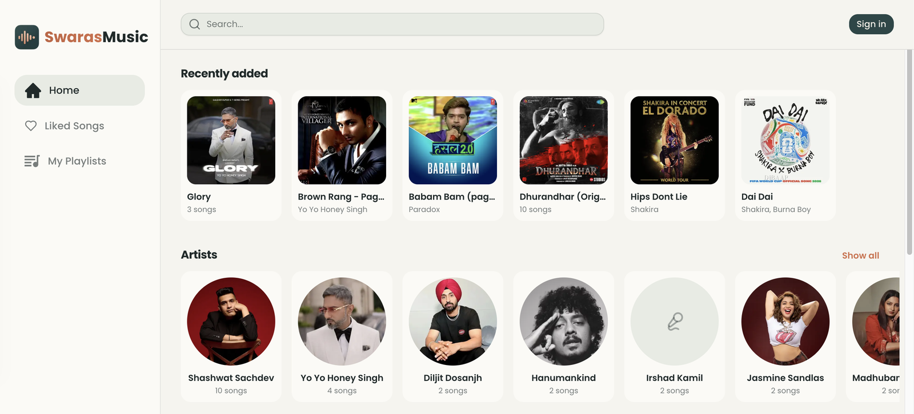
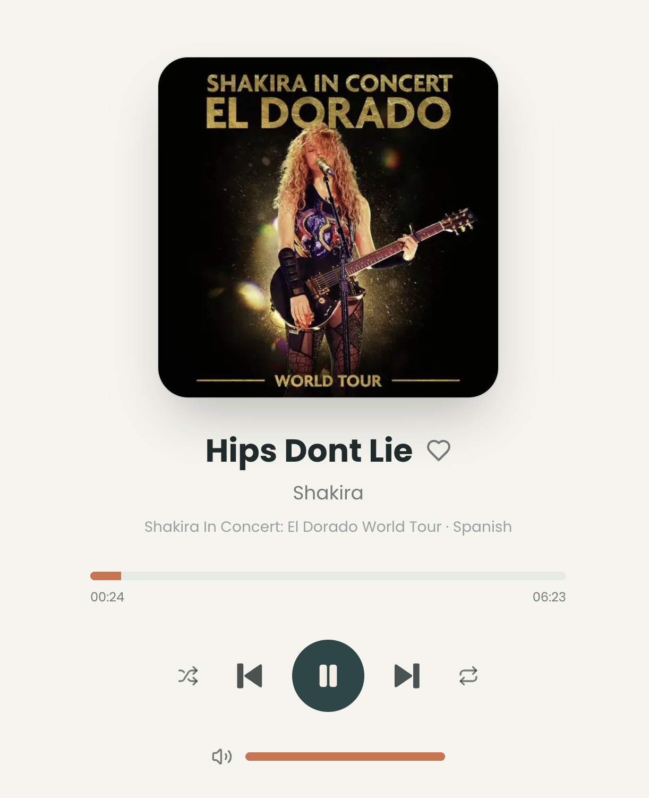

# Swaras

A music streaming app: admins upload tracks, anyone can browse and listen without an account, and signed-in users like songs and build playlists. It is a single Next.js 15 App Router application that is also its own backend — 20 Route Handlers, no separate API service — with Supabase supplying Postgres (through PostgREST, no ORM and no runtime `DATABASE_URL`), Auth and Storage. The parts worth reading are where that arrangement gets sharp: playback URLs are signed by exactly one `server-only` module, 100MB uploads bypass the serverless function entirely and go browser-to-Storage over TUS, and Row Level Security is real authorization rather than a checkbox.


**Live:** [music.rahuls.dev](https://music.rahuls.dev) · **Source:** [github.com/sutharrahul/swaras-music-app](https://github.com/sutharrahul/swaras-music-app)



_Home: the "Recently added" shelf and the Artists rail, both derived from song metadata._



## At a glance

|                  |                                                                                                                      |
| ---------------- | -------------------------------------------------------------------------------------------------------------------- |
| **What it is**   | Self-hosted music streaming — admin upload, public listening, per-user likes and playlists                           |
| **Stack**        | Next.js 15 (App Router) · React 19 · TypeScript · Tailwind v4 · TanStack Query · Supabase · Vercel                   |
| **Architecture** | One Next.js app is the whole backend; Supabase is the database, auth and object store; RLS enforces access           |
| **Hosting**      | Vercel `bom1`, colocated with an `ap-south-1` Supabase project                                                       |
| **Scale**        | 18 pages · 20 API route handlers · 12 migrations · 13 tables (8 actively queried)                                    |
|                  | 31 RLS policies (19 table, 12 storage) · 3 storage buckets · 7 Postgres functions · ~132 TS/TSX files, ~13,400 lines |
| **Theme**        | Light only — a dark mode was built and then deliberately removed                                                     |

[Features](#features) · [Architecture](#architecture) · [Getting started](#getting-started) · [Project structure](#project-structure) · [API reference](#api-reference) · [Deployment](#deployment) · [Development](#development) · [Known limitations](#known-limitations) · [Roadmap](#roadmap) · [Contributing](#contributing) · [License](#license)

---

## Features

**For listeners.** Playback runs from a persistent bottom bar — seek, volume remembered across sessions, shuffle, repeat off/all/one — and clicking the artwork opens a full-screen now-playing view over the same audio element. The queue is whatever list you started from, so "play all" on an artist makes that the queue rather than the whole catalogue. Keyboard shortcuts cover the app (Space, arrows, `M` mute, `S` shuffle, `R` repeat, `L` like) and the Media Session API mirrors the track to OS lock screens and hardware media keys.

- Signed-out visitors get everything: home, `/songs`, artists, albums, movies and search are public and playable.
- Home is shelves — recently added (a real 7-day window, multi-track uploads collapsed into one album card), most liked, artist and album rails, then a preview of all songs.
- Likes need an account. The heart is server state, so it survives a reload and a second device; `/liked` reads the same cache the player does.
- Playlists: create, add a song from any row's menu, remove one, delete the whole list.
- Artist pages carry an admin-set photo and bio plus a play-all; `/artists` and `/albums` are infinite grids reporting the server's true total, not the count loaded so far.
- Search is debounced at 300ms and returns songs and playlists in one keyboard-navigable listbox.
- `/songs` paginates ten to a page with the page number in the URL, so the back button steps through it.
- Sign-in, sign-up and forgot-password open as modals over the current page (intercepting routes) and still render as full pages on a direct hit. Auth is email/password with confirmation, Google OAuth, and a reset flow that refuses to leak whether an address is registered.

**For admins.** Upload up to 10 tracks at once, each up to 100MB, straight from the browser to Storage over TUS in 6MB chunks with per-file progress. ID3 tags and embedded cover art are read client-side; unreadable tags fall back to the filename rather than failing the file, and a comma-separated artist tag is split into multiple artists. Song metadata (title, artists, composers, album, movie, genre, lyrics) is editable from the Manage Songs tab, rows can be bulk-selected and deleted, and artist photos and bios are managed in the Artists tab. The admin UI is gated on a live role check for rendering only — every endpoint behind it re-checks with `requireAdmin()`, and RLS checks again in the database.

---

## Architecture

The 18 pages and the 20 Route Handlers under `src/app/api/**` ship as a single Vercel project in region `bom1`, colocated with an `ap-south-1` Supabase project so the many small PostgREST round-trips stay cheap.

The data layer is `supabase-js` talking to PostgREST over HTTP. No ORM, no `DATABASE_URL` at runtime, no connection pool to size or exhaust — which is what makes serverless functions a reasonable place to put the backend at all. Handlers read explicit column lists (`SONG_COLUMNS`) and map rows to DTOs in `src/lib/dto.ts`; the types in `src/lib/database.types.ts` are generated from the live database, so a migration that breaks a query breaks `npm run type-check`.

Authorization is three layers, each assuming the others can fail:

1. **Middleware, deny-by-default.** `src/utils/supabase/middleware.ts` refreshes the auth cookies _and_ matches the path against an explicit public list. Anything unlisted requires a session: API routes get a 401, pages redirect to `/sign-in?next=…`. Roles are deliberately not checked here — that would cost a database round-trip on every matched request.
2. **Session-derived identity in every handler.** `requireUser()` / `requireAdmin()` / `optionalUser()` in `src/lib/auth.ts` are the only way a handler learns who the caller is. They use `getUser()` (which revalidates the token with the auth server) rather than `getSession()` (which decodes a cookie), and accept an id from no body, query param or header. Four IDOR bugs were found and closed by making this the single door.
3. **RLS underneath both.** 19 table policies and 12 storage policies mean a handler that forgets a filter still cannot read another user's playlists. `songs_select_public` is what lets anonymous visitors browse at all.

**Playing a song, end to end.** `GET /api/get-songs` passes the middleware's public list, resolves an optional user, and pages `songs` through PostgREST. `toSongDtos` then makes one `createSignedUrls` call for the whole page — never one per track — and the response goes out `private, no-store` because it carries expiring tokens. The browser plays that URL straight from Supabase Storage's CDN; the app server is not in the audio path and serves no bytes.

### Decisions worth knowing

**Exactly one module may sign a playback URL.** `src/lib/storage.server.ts` is `server-only` and holds the sole `SUPABASE_SECRET_KEY` client, which bypasses RLS. Supabase Storage authorizes `/object/sign/` against the bucket's SELECT policy, so _any_ SELECT policy on `song-audio` would let that role enumerate the bucket and mint its own signed URLs at any TTL it chose. The bucket therefore has no SELECT policy for ordinary users, and the module only signs paths a handler already read out of `songs` for that request. Honest scope: listening is public, so this buys expiry and server-controlled issuance, not secrecy.

**Sign once per listing, not once per play.** A fresh signed token is always a CDN miss while a repeated token caches (measured). Re-signing per playback would turn every seek into a cold origin fetch, so `AUDIO_URL_TTL_SECONDS` is hours — the URL has to outlive the listening session — and every endpoint carrying one is `private, no-store` so no shared cache hands out a part-spent token.

**Uploads never pass through a function.** A Vercel request body caps near 4.5MB and a track can be 100MB, so the browser uploads to Storage over TUS in 6MB resumable chunks (`tus-js-client`). `POST /api/upload-song` mints only a job: the client sends a manifest of names and sizes and gets back object paths the _server_ derived from ids it generated. `/complete` re-reads those paths from `upload_job_items` and verifies the stored object rather than believing the caller — a client-supplied path would let an admin register a song pointing at an object they never uploaded.

**Roles are read live from `public.users.role`, never from a JWT claim.** A claim is stamped at signup and survives a demotion, and `user_metadata` is writable from the browser outright. So `requireAdmin()` spends one PostgREST round-trip per request to ask the database what the caller is right now. That cost is the feature.

**Email is not an identity.** `supabase_user_id` is the only link between an auth identity and an app row; nothing matches a user by email, and the signup trigger's `ON CONFLICT DO NOTHING` deliberately leaves a colliding identity with no profile (a fail-closed 403) rather than adopting someone else's row. `users_email_key` was dropped for the same reason — a unique email let a stranger squat an address at signup and lock out its real owner permanently.

**Artists and albums are derived, not modelled.** `artist_song_counts()` unnests `songs.artist text[]` and `album_song_counts()` aggregates `songs.album`, both at query time. `public.artists` exists only as a profile side-table keyed by name, consulted afterwards for a photo; a name with no row there is normal, not an error. The tradeoff is real — a typo or an inconsistent tag silently creates a second artist, and nothing can rename one everywhere at once. It is chosen because the catalogue is admin-curated from ID3 tags, where a normalised model would mean a reconciliation UI nobody has built.

### Stack

| Layer        | Choice                                                   |
| ------------ | -------------------------------------------------------- |
| Framework    | Next.js 15 (App Router, React 19, Turbopack dev)         |
| Backend      | Next.js Route Handlers — no separate service             |
| Database     | Supabase Postgres via `supabase-js` / PostgREST (no ORM) |
| Auth         | Supabase Auth (`@supabase/ssr`, cookie sessions)         |
| Storage      | Supabase Storage, 3 buckets; `song-audio` private        |
| Uploads      | `tus-js-client`, browser → Storage, 6MB chunks           |
| Tag reading  | `music-metadata` (ID3 parsed in the browser)             |
| Server state | TanStack Query (+ axios wrappers in `src/hook/`)         |
| Styling      | Tailwind CSS v4, CSS-first `@theme` in `globals.css`     |
| UI           | shadcn/ui (new-york) over Radix, `lucide-react` icons    |
| Validation   | zod, schemas shared between handler and client           |
| Hosting      | Vercel (`bom1`) + Supabase (`ap-south-1`)                |

---

## Getting started

**Prerequisites:** Node 20 or newer (`"engines": { "node": ">=20" }`), npm, and a Supabase project. The Supabase CLI is invoked through `npx` — no global install. Note that Supabase's Free plan caps every Storage object at 50MB regardless of the 100MB limit the `song-audio` bucket advertises.

```bash
git clone https://github.com/sutharrahul/swaras-music-app.git
cd swaras-music-app
npm install
cp .env.example .env.local
```

Four variables, and the app reads no others. The same four go into Vercel Project Environment Variables when you deploy.

| Variable                               | What it is                                                                                                                                                                                                                                             |
| -------------------------------------- | ------------------------------------------------------------------------------------------------------------------------------------------------------------------------------------------------------------------------------------------------------ |
| `NEXT_PUBLIC_SUPABASE_URL`             | Your project's API URL. Also read at build time by `next.config.ts` to derive the allowed `next/image` host.                                                                                                                                           |
| `NEXT_PUBLIC_SUPABASE_PUBLISHABLE_KEY` | The publishable (anon) key. Safe in the browser — it maps to `anon` and cannot bypass RLS.                                                                                                                                                             |
| `SUPABASE_SECRET_KEY`                  | Server-only; runs as `service_role` and **bypasses RLS**. `src/lib/storage.server.ts` uses it to sign playback URLs. Never give it a `NEXT_PUBLIC_` prefix. Leave it empty and the app still builds — every `audioUrl` just comes back null, silently. |
| `NEXT_PUBLIC_SITE_URL`                 | `metadataBase` for absolute Open Graph and canonical URLs. Auth redirects do **not** come from here — they derive from `window.location.origin`.                                                                                                       |

`CRON_SECRET` is optional and only matters if you add a `crons` entry to `vercel.json` for `/api/upload-song/sweep-expired`; without it that cleanup is still runnable by hand as an admin. There is no `DATABASE_URL` or `DIRECT_URL` — supabase-js talks HTTP to PostgREST, so the app never opens a Postgres connection.

```bash
npx supabase login
npx supabase link --project-ref <your-project-ref>
npm run db:push     # applies supabase/migrations/** (12 files)
npm run db:types    # regenerates src/lib/database.types.ts from the live schema
npm run dev         # http://localhost:3000
```

Migrations are append-only: once a file has been applied, correct it with a new migration, never by editing it. There is no seed script, so a fresh install shows an empty catalogue — that is correct, not a bug.

### Before anyone else uses it

Three dashboard steps a fresh deployment does not do for you, all with silent failure modes.

**URL configuration** (Authentication → URL Configuration). A `redirectTo` that fails the allow-list is _not_ an error — Supabase silently substitutes the Site URL, so the confirmation link lands on the wrong origin and the only trace is the `redirect_to=` parameter inside the email. Set Site URL to your production domain (one value, no wildcard, no trailing slash) and list every host anyone might sign up on: `http://localhost:3000/**`, production, each preview pattern. Avoid `https://*.vercel.app/**` and anything starting with `**` — both hand your auth codes to hosts you do not control.

**Custom SMTP.** Supabase's built-in sender is capped at roughly 2 emails per hour for the entire project, shared between signup confirmation and password reset, and it drops mail to addresses outside your organisation. Configure Resend, Postmark or SES — with SPF/DKIM — before giving anyone the URL. Sign-up returns 200 either way; the mail just never arrives.

**The first admin.** There is no API path — column privileges deliberately stop a user writing their own role. Sign up normally, then in the SQL Editor:

```sql
update public.users set role = 'ADMIN' where email = 'you@example.com';
```

---

## Project structure

```
src/
├─ app/                       pages + the 20 Route Handlers; Next.js is the backend
│  ├─ @modal/                 parallel slot — (.)sign-in, (.)sign-up, (.)forgot-password
│  │                          intercept their own pages so auth opens over the current view
│  ├─ api/                    admin/, artists/, albums/, playlists/, search/, upload-song/…
│  ├─ auth/callback/route.ts  exchanges the Supabase code for the session cookie
│  ├─ artist/[name]/          browse pages keyed by a value on songs (artist[]/album/movie),
│  ├─ album/[name]/           not by a foreign key — the catalogue is derived, not relational
│  ├─ movie/[name]/
│  ├─ artists/ albums/ songs/ liked/ playlist/[playlistId]/ admin/
│  ├─ forgot-password/ reset-password/ sign-in/ sign-up/
│  └─ globals.css             design tokens; light theme only
├─ components/                admin/ auth/ states/ ui/ (shadcn primitives)
│                             MusicPlayer, ExpandedPlayer, Shelf, *Card, Providers
├─ context/                   SongContextProvider — queue, repeat, current song
├─ hook/                      TanStack Query layer, split in two on purpose:
│  ├─ apiHooks/               axios wrappers, one per resource; no cache, no React state
│  └─ query/                  useQuery/useMutation + cache keys and invalidations
├─ hooks/                     useSupabaseUser, useMediaSession, useInfiniteScroll
├─ lib/
│  ├─ auth.ts                 requireUser / requireAdmin / optionalUser — the only way a
│  │                          handler learns the caller; ids never come from the request
│  ├─ api.ts                  zod parsing, limit clamp, PostgREST error mapping
│  ├─ dto.ts                  snake_case rows → the camelCase shape the UI reads
│  ├─ storage.server.ts       server-only; the ONLY module that may sign a playback URL
│  ├─ storage.ts              bucket names and object paths, isomorphic so they can't drift
│  ├─ tusUpload.ts            browser-side resumable upload; never sees a secret
│  └─ database.types.ts       generated — `npm run db:types`, do not hand-edit
├─ types/models.ts            API wire shapes (≠ database row shapes)
├─ utils/supabase/            client / server / middleware Supabase clients
└─ middleware.ts              refreshes auth cookies AND applies deny-by-default routing

supabase/migrations/          12 SQL files, append-only
```

Data flow through the client is one-directional: `apiHooks/` holds thin axios calls that know a URL and a response type and nothing else; `query/` wraps those in TanStack Query, owning cache keys, pagination and invalidation; components consume only `query/` hooks. A component importing an `apiHooks` function directly is how a fetch ends up outside the cache and stops being invalidated on a mutation or an auth change.

---

## API reference

All 20 handlers share one rule: **the caller is derived from the verified session, never from the request.** Every response is `{ success, message, data }`. Paginated endpoints take `?page=&limit=` and return `pagination: { page, limit, total, hasMore }`, with `limit` clamped server-side to 100 (default 20) and junk rejected with a 400. A 500 never echoes the underlying exception. Anything carrying a signed audio URL or per-user rows is sent `private, no-store`.

**Songs & search**

| Method | Path             | Auth   | Notes                                                                                                                           |
| ------ | ---------------- | ------ | ------------------------------------------------------------------------------------------------------------------------------- |
| GET    | `/api/get-songs` | public | The catalogue, paginated. Optional `?artist=`, `?album=`, `?movie=`. Signed playback URLs are minted here, once per listing.    |
| GET    | `/api/search`    | public | Songs by title/album/artist, plus the caller's playlists when signed in. `?q=` is sanitized against PostgREST filter injection. |

**Artists & albums** — derived from `songs.artist` / `songs.album` via Postgres functions; `public.artists` is only a profile side-table.

| Method | Path                   | Auth   | Notes                                                                                              |
| ------ | ---------------------- | ------ | -------------------------------------------------------------------------------------------------- |
| GET    | `/api/artists`         | public | Directory with song counts and photos, paginated.                                                  |
| GET    | `/api/artists/profile` | public | One artist's photo and bio by `?name=`. A missing row is a 200 with `imageUrl: null`, never a 404. |
| GET    | `/api/albums`          | public | Album directory with song counts and cover art, paginated.                                         |

**Playlists** — filtered by session user _and_ enforced by `playlists_owner_all`. Someone else's playlist returns 404, not 403; a 403 would confirm the id exists.

| Method       | Path                          | Auth      | Notes                                                                            |
| ------------ | ----------------------------- | --------- | -------------------------------------------------------------------------------- |
| GET / POST   | `/api/playlists`              | signed-in | List the caller's playlists; create one (`name`, optional `description`).        |
| GET / DELETE | `/api/playlists/[playlistId]` | signed-in | One playlist with its songs; delete it.                                          |
| POST         | `/api/post-playlist`          | signed-in | Add a song to a playlist.                                                        |
| DELETE       | `/api/remove-playlist-song`   | signed-in | Remove a song from a playlist.                                                   |
| DELETE       | `/api/delete-playlist`        | signed-in | Older body-based spelling of the delete above; still called by `usePlaylistApi`. |

**Likes**

| Method        | Path                   | Auth      | Notes                                                             |
| ------------- | ---------------------- | --------- | ----------------------------------------------------------------- |
| POST / DELETE | `/api/like-song`       | signed-in | Like or unlike. A duplicate like is a 409, an unknown song a 404. |
| GET           | `/api/get-liked-songs` | signed-in | The caller's liked songs, paginated.                              |

**Uploads** — no file bytes pass through any of these.

| Method | Path                             | Auth            | Notes                                                                                                                      |
| ------ | -------------------------------- | --------------- | -------------------------------------------------------------------------------------------------------------------------- |
| POST   | `/api/upload-song`               | admin           | Start a job from a manifest; returns server-minted bucket paths recorded in `upload_job_items`.                            |
| POST   | `/api/upload-song/complete`      | admin           | Register a finished upload as a `songs` row. Paths are re-read from the job and the object's size must match the manifest. |
| POST   | `/api/upload-song/sweep-expired` | admin _or_ cron | Expire abandoned jobs, delete orphaned objects. Accepts `Authorization: Bearer $CRON_SECRET`; no schedule is wired up.     |

**Admin & auth**

| Method                | Path                        | Auth      | Notes                                                                                                                                         |
| --------------------- | --------------------------- | --------- | --------------------------------------------------------------------------------------------------------------------------------------------- |
| DELETE                | `/api/admin/delete-song`    | admin     | Delete a song row and its Storage objects.                                                                                                    |
| PATCH                 | `/api/admin/update-song`    | admin     | Edit song metadata. Omitted fields are left alone, not nulled.                                                                                |
| POST / PATCH / DELETE | `/api/admin/artist-photo`   | admin     | Mint the upload path, confirm the uploaded photo, clear it.                                                                                   |
| PATCH                 | `/api/admin/artist-profile` | admin     | Set or clear an artist's bio.                                                                                                                 |
| GET                   | `/api/check-admin`          | signed-in | `{ isAdmin, role }` read live from `public.users.role` — never a JWT claim, never the internal user id.                                       |
| GET                   | `/auth/callback`            | public    | Outside `src/app/api`. Handles the PKCE `?code=` exchange and `?token_hash=&type=` one-time tokens; `next` is restricted to a same-site path. |

---

## Deployment

A standard Next.js project on Vercel — no build command overrides, no codegen, nothing in the build that touches a database. `docs/DEPLOYMENT.md` is the full checklist.

Scope the four variables above as: `NEXT_PUBLIC_SUPABASE_URL` and `NEXT_PUBLIC_SUPABASE_PUBLISHABLE_KEY` on Production + Preview; `SUPABASE_SECRET_KEY` on Production + Preview, marked Sensitive; `NEXT_PUBLIC_SITE_URL` on Production only. Because `NEXT_PUBLIC_*` values are frozen into the bundle at build time, editing one in the dashboard changes nothing until you redeploy. Do not add `DATABASE_URL` or `DIRECT_URL` — a leftover instinct from the Prisma era that buys nothing but a leaked credential.

Migrations are applied by a human with `npm run db:push` **before** the deploy that needs them. Nothing in the build applies them, so code expecting a new column against an old schema fails at runtime.

`vercel.json` pins `regions: ["bom1"]` (Mumbai) to sit next to the `ap-south-1` Supabase project. With no ORM and no connection pool, every render and every handler is a chain of sequential HTTPS round trips to PostgREST, Auth and Storage; put the functions in `iad1` and each hop pays transpacific latency several times per request. Colocation is the whole performance story for this stack — if you point the app at another region, follow the database, not the users.

---

## Development

```bash
npm run dev          # Turbopack dev server
npm run lint         # eslint
npm run type-check   # tsc --noEmit
npm run format       # prettier — single quotes, 2-space, 100 cols
npm run build        # next build
```

There is no test suite, so those commands are the entire gate. `build` is the closest thing to an integration test: it type-checks every Server Component and route handler against the generated Supabase types. Run `npm run db:types` after a schema change — a stale `database.types.ts` lets a build pass against a column that no longer exists.

---

## Known limitations

- **No automated tests.** Correctness rests on the type checker and manual verification. The highest-value first tests are authorization assertions against the route handlers — that a non-admin cannot reach an admin route, that one user cannot read another's playlists.
- **No CI.** Lint, type-check and build run only where someone remembers to run them. A GitHub Actions workflow on pull requests closes this in about fifteen lines.
- **No monitoring or error tracking.** A 500 is visible only in Vercel's runtime logs and nobody is paged. One constraint before wiring anything up: never log request headers or response bodies — a `Bearer` token in a log is a session handed to whoever reads it.
- **No rate limiting on public endpoints.** `/api/get-songs` and the auth routes are open at any rate. Supabase enforces its own limits underneath, which is not the same as this app defending itself.
- **Unused tables.** `albums`, `movies`, `album_artists`, `song_credits` and `webhook_events` are residue from an abandoned normalised catalogue and the Clerk era — 5 of the 13 tables, queried by nothing. Harmless, but misleading to anyone reading the schema cold.
- **Artists are matched by string name.** "A.R. Rahman" and "AR Rahman" are two different artists, and a typo in an ID3 tag forks one permanently. A real fix is an artist table with IDs and aliases — a data migration, not a code change.
- **Email delivery is entirely the SMTP provider's.** No fallback, no retry, no bounce visibility. Misconfigure it and sign-up returns 200 while the user never hears back.
- **No internationalisation.** All copy is hardcoded English.

## Roadmap

- Authorization tests on the route handlers, then a CI workflow running them alongside lint, type-check and build.
- Real artist identity — IDs and aliases instead of string matching — plus dropping the five dead tables in the same pass.
- Rate limiting and error tracking: the two things standing between this and being safely public.

## Contributing

Issues and pull requests are welcome at [github.com/sutharrahul/swaras-music-app](https://github.com/sutharrahul/swaras-music-app). Read `CLAUDE.md` first — it documents the load-bearing decisions that look like mistakes until you know why they exist. Run `npm run lint`, `npm run type-check` and `npm run build` before opening a PR, and remember that migrations are append-only.

## License

MIT.

**Rahul Suthar** — [@sutharrahul](https://github.com/sutharrahul) · [LinkedIn](https://www.linkedin.com/in/suthar-rahul/)

_Last updated: 15 August 2026_
